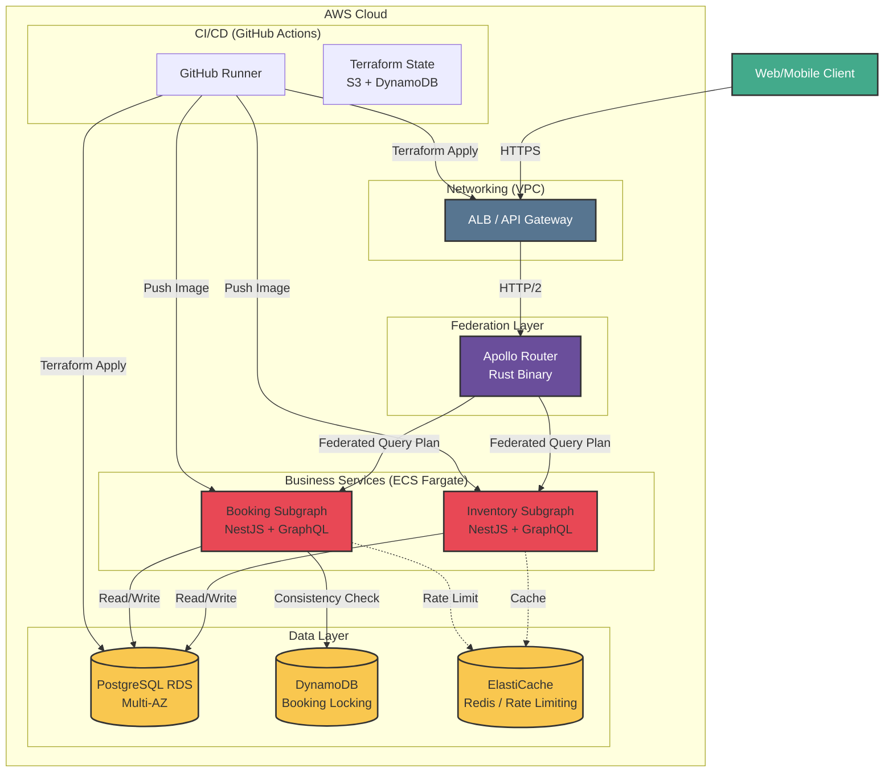

# Hotel Federation Cloud 🏨 ☁️

A high-throughput, federated GraphQL architecture designed for resilience, observability, and real-time data ingestion. This project demonstrates a production-grade cloud ecosystem leveraging **Apollo Federation 2**, **Kafka**, and **Terraform** on AWS.

## 🏗 Architectural Blueprint

The system is built on a **Documentation-as-Infrastructure** philosophy. 



## Architecture Overview (3-Layer Cloud-Native Design)

- **Layer 1 (Edge & Networking)** – ALB/API Gateway + Apollo Router (Rust) handles HTTPS termination, HTTP/2 routing, and federated query planning
- **Layer 2 (Business Services)** – Inventory & Booking subgraphs (NestJS + GraphQL) execute business logic, validation, and federation entity resolution on ECS Fargate
- **Layer 3 (Data Persistence)** – PostgreSQL RDS (Multi-AZ) for primary state, DynamoDB for booking consistency/locking, ElastiCache Redis for caching & rate limiting
- **CI/CD** – GitHub Actions pushes images and applies Terraform changes across all three layers with state locked in S3 + DynamoDB

Every network component is version-controlled and deployed via automated CI/CD.

* **Gateway:** Apollo Router (Rust-based) orchestrating a distributed subgraph mesh.
* **Subgraphs:** Independent NestJS services (Booking, Inventory) handling domain-specific logic.
* **Event Bus:** Kafka-driven event streaming for asynchronous data persistence.
* **Data Lake:** Real-time ingestion from Kafka into **Snowflake** for analytics.
* **Cloud Foundation:** Multi-AZ AWS VPC with strict network isolation (Public/Private/DB tiers).

---

## 🚀 Infrastructure (Terraform)

The infrastructure is managed via Terraform and deployed through GitHub Actions. 

### Key Features:
* **State Management:** Remote S3 backend with DynamoDB state locking.
* **Network Perimeter:** Isolated private subnets for subgraphs; public access restricted to the Application Load Balancer (ALB).
* **Zero-Trust:** Least-privilege Security Groups ensuring services only communicate over required ports (e.g., 4000 for Router, 9092 for Kafka).

**To deploy:**
```bash
cd infrastructure/aws
terraform init
terraform apply
🛠 Local Development (Docker-Compose)
For rapid iteration, a hardened Docker environment mirrors the production cloud topology.

Security Hardening:
Version Pinning: No :latest tags; all images use immutable version hashes.

Secrets Management: Utilizes .env files to prevent credential leakage.

Isolated Networks: Custom bridge network (hotel-mesh) to prevent cross-container interference.

Startup:

Bash
# Ensure you create a .env file based on .env.example
docker-compose up -d
📊 Observability & Reliability
Following an Observability-First design, the system is instrumented with:

OpenTelemetry: Distributed tracing across federated subgraphs.

Prometheus/Grafana: Infrastructure and application-level metrics.

Dead Letter Queues (DLQ): Ensuring Kafka message durability during ingestion failures.

👨‍💻 Author
Andres Arias - Senior Full-Stack Software Engineer & Cloud Architect

Specializing in resilient, scalable, and maintainable cloud-native systems.

AWS Certified Solutions Architect – Associate.